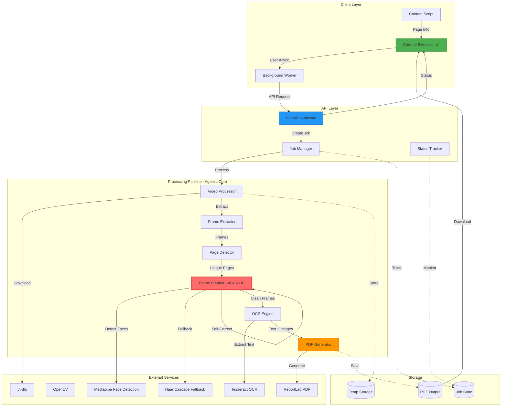

# System Architecture - YouTube Notes Extractor

## Overview

The YouTube Notes Extractor is a full-stack system that intelligently extracts clean study notes from YouTube videos and compiles them into searchable PDFs. The system uses an **agentic architecture** with self-correcting algorithms that validate and improve their output.

## Architecture Diagram



## Component Details

### 1. Client Layer (Chrome Extension)

#### Chrome Extension UI (`popup.html`, `popup.js`)
- **Responsibility**: User interface for initiating extraction
- **Features**:
  - Video detection and display
  - Quality selection (480p, 720p, 1080p)
  - Real-time progress tracking
  - Download management
- **Technology**: HTML5, CSS3, Vanilla JavaScript

#### Content Script (`content.js`)
- **Responsibility**: Interact with YouTube page
- **Features**:
  - Extract video metadata
  - Optional visual indicators
- **Technology**: JavaScript (injected into YouTube pages)

#### Background Worker (`background.js`)
- **Responsibility**: Service worker for background tasks
- **Features**:
  - Message passing
  - Notifications
  - Settings management
- **Technology**: Manifest V3 Service Worker

### 2. API Layer (FastAPI Backend)

#### FastAPI Gateway (`main.py`)
- **Responsibility**: HTTP API endpoints
- **Endpoints**:
  - `POST /api/extract` - Start extraction job
  - `GET /api/status/{job_id}` - Check job status
  - `GET /api/download/{job_id}` - Download PDF
- **Features**:
  - CORS handling
  - Request validation
  - Error handling
- **Technology**: FastAPI, Pydantic

#### Job Manager
- **Responsibility**: Manage extraction jobs
- **Features**:
  - Job creation and tracking
  - Background task execution
  - State management
- **Technology**: Python async/await

### 3. Processing Pipeline (Agentic Core)

#### Video Processor (`video_processor.py`)
- **Responsibility**: Download and extract frames from video
- **Process**:
  1. Download video using yt-dlp
  2. Extract frames at specified FPS (default: 1 fps)
  3. Return frames with timestamps
- **Technology**: yt-dlp, OpenCV

#### Page Detector (`page_detector.py`)
- **Responsibility**: Detect unique slides/pages
- **Algorithm**:
  1. Calculate perceptual hash (pHash) for each frame
  2. Compare consecutive frames using Hamming distance
  3. Filter out duplicates and minor changes
  4. Ensure minimum page duration (default: 2 seconds)
- **Technology**: imagehash, PIL
- **Parameters**:
  - `hash_threshold`: Hamming distance threshold (default: 10)
  - `diff_threshold`: Frame difference threshold (default: 0.15)
  - `min_page_duration`: Minimum seconds per page (default: 2.0)

#### Frame Cleaner - AGENTIC COMPONENT (`frame_cleaner.py`)
- **Responsibility**: Remove obstructions (facecams, overlays, watermarks)
- **Agentic Features**:
  1. **Quality Pre-Check**: Validates frame quality before processing
  2. **Multi-Method Detection**: Uses Mediapipe + Haar Cascade fallback
  3. **Intelligent Inpainting**: Removes obstructions with context-aware filling
  4. **Self-Validation**: Checks if cleaning succeeded
  5. **Fallback Strategy**: Uses conservative approach if aggressive fails
  6. **Final Validation**: Returns original if all methods fail

- **Detection Methods**:
  - **Face Detection**: Mediapipe (primary), Haar Cascade (fallback)
  - **Overlay Detection**: Edge density analysis in common regions
  - **Region Merging**: Combines overlapping obstructions

- **Cleaning Methods**:
  - **Aggressive**: Telea inpainting algorithm
  - **Conservative**: Background color averaging + blur

- **Self-Correction Logic**:
```python
if is_low_quality(frame):
    return frame  # Skip processing
    
cleaned = remove_obstructions(frame)

if not is_valid_cleaned_frame(cleaned):
    cleaned = conservative_clean(frame)
    
    if not is_valid_cleaned_frame(cleaned):
        return frame  # Return original
        
return cleaned
```

- **Technology**: Mediapipe, OpenCV, NumPy

#### OCR Engine (`ocr_engine.py`)
- **Responsibility**: Extract text from cleaned frames
- **Process**:
  1. Preprocess image (grayscale, denoise, threshold)
  2. Apply CLAHE for contrast enhancement
  3. Run Tesseract OCR
  4. Clean and format extracted text
- **Technology**: Tesseract, OpenCV
- **Features**:
  - Multi-language support
  - Confidence scoring
  - Text cleanup and formatting

#### PDF Generator (`pdf_generator.py`)
- **Responsibility**: Create searchable PDF
- **Process**:
  1. Create title page with metadata
  2. Add each frame as full-page image
  3. Overlay invisible OCR text for searchability
  4. Generate table of contents (optional)
- **Technology**: ReportLab, PIL
- **Features**:
  - Searchable text layer
  - Custom styling
  - Metadata embedding

## Data Flow

### Extraction Pipeline

```
1. User clicks "Start Extraction"
   ↓
2. Extension sends YouTube URL to API
   ↓
3. API creates job and returns job_id
   ↓
4. Background task starts processing:
   
   a. Download video (yt-dlp)
      Progress: 10%
      
   b. Extract frames (OpenCV)
      Progress: 25%
      
   c. Detect unique pages (pHash)
      Progress: 40%
      
   d. Clean frames (Mediapipe + Agentic Logic)
      Progress: 60%
      For each frame:
        - Check quality
        - Detect obstructions
        - Remove obstructions
        - Validate result
        - Fallback if needed
      
   e. Extract text (Tesseract)
      Progress: 80%
      
   f. Generate PDF (ReportLab)
      Progress: 90%
      
   g. Cleanup temporary files
      Progress: 100%
   ↓
5. Extension polls for status every 2 seconds
   ↓
6. User downloads PDF when complete
```

## Agentic Self-Correction

The **Frame Cleaner** is the core agentic component with multiple self-correction mechanisms:

### 1. Pre-Processing Validation
```python
def is_low_quality(frame) -> bool:
    # Check dimensions
    # Check brightness (too dark/bright)
    # Check sharpness (blurry frames)
    # Return True to skip processing
```

### 2. Multi-Method Detection
```python
# Try Mediapipe first (more accurate)
faces = detect_faces_mediapipe(frame)

# Fallback to Haar Cascade if needed
if not faces:
    faces = detect_faces_haar(frame)

# Also detect overlays and watermarks
overlays = detect_overlays(frame)
```

### 3. Post-Processing Validation
```python
def is_valid_cleaned_frame(frame) -> bool:
    # Check for corruption
    # Check for excessive black/white areas
    # Verify frame integrity
    # Return False if cleaning failed
```

### 4. Fallback Strategy
```python
# Try aggressive cleaning
cleaned = inpaint(frame, mask)

if not is_valid_cleaned_frame(cleaned):
    # Try conservative approach
    cleaned = conservative_clean(frame)
    
    if not is_valid_cleaned_frame(cleaned):
        # Return original as last resort
        return frame
```

## Technology Stack

### Backend
- **Framework**: FastAPI 0.109.0
- **Video Processing**: yt-dlp, OpenCV 4.9
- **Face Detection**: Mediapipe 0.10.9
- **Fallback Detection**: Haar Cascades (OpenCV)
- **OCR**: Tesseract 0.3.10
- **Image Processing**: NumPy, Pillow, imagehash
- **PDF Generation**: ReportLab 4.0.9
- **Server**: Uvicorn (ASGI)

### Frontend
- **Extension**: Chrome Manifest V3
- **UI**: HTML5, CSS3 (Vanilla)
- **Logic**: JavaScript ES6+
- **Styling**: Custom CSS with gradients and animations

## Deployment

### Development
```bash
# Backend
cd backend
python -m venv venv
venv\Scripts\activate
pip install -r requirements.txt
python main.py

# Extension
# Load unpacked in chrome://extensions/
```

### Production Considerations
1. **Backend**:
   - Deploy to cloud (AWS, GCP, Azure)
   - Use Redis for job state
   - Add authentication
   - Rate limiting
   - CDN for PDF downloads

2. **Extension**:
   - Publish to Chrome Web Store
   - Update API URL to production
   - Add analytics
   - Error reporting

## Security

### Backend
- Input validation (Pydantic models)
- URL sanitization
- File size limits
- Temporary file cleanup
- CORS restrictions

### Extension
- Content Security Policy
- Minimal permissions
- Secure API communication
- No sensitive data storage

## Performance

### Optimization Strategies
1. **Frame Extraction**: Sample at 1 fps (configurable)
2. **Page Detection**: Early duplicate filtering
3. **Parallel Processing**: Async operations
4. **Memory Management**: Stream processing, cleanup
5. **Caching**: Reuse computed hashes

### Expected Performance
- **5-minute video**: ~2-3 minutes processing
- **30-minute lecture**: ~10-15 minutes processing
- **Memory usage**: 2-4 GB peak
- **Disk usage**: 2x video size (temporary)

## Error Handling

### Graceful Degradation
1. **Video download fails**: Clear error message
2. **Face detection fails**: Use Haar Cascade fallback
3. **Cleaning corrupts frame**: Return original
4. **OCR fails**: Generate non-searchable PDF
5. **Network issues**: Retry with exponential backoff

## Future Enhancements

1. **Multi-platform support**: Vimeo, Coursera, etc.
2. **Cloud processing**: Offload to serverless functions
3. **Batch processing**: Multiple videos at once
4. **Smart summarization**: AI-generated notes
5. **Collaborative features**: Share and annotate
6. **Mobile app**: iOS/Android versions
7. **Advanced OCR**: Handwriting recognition
8. **Language translation**: Multi-language support

## License

MIT License
